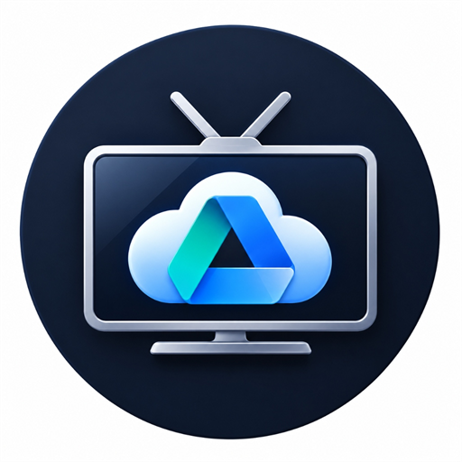

# NovaDrive TV 📺☁️

<p align="center">
  
</p>

<p align="center">
  <b>A modern, glassmorphic Google Drive & Google Photos client crafted specifically for Android TV & Google TV.</b>
</p>

<p align="center">
  <a href="https://github.com/abhi340/NovaDrive/releases">
    
  </a>
  <a href="release/NovaDrive-v1.0-release.apk">
    
  </a>
  
  
</p>

---

## 🚀 Features

- **📺 10-Foot Leanback UI:** Tailored from the ground up for big-screen TVs, smooth D-pad focus traversal, and fluid remote navigation.
- **☁️ Google Drive Cloud Explorer:** Browse directories, documents, audio, videos, and images stored in your personal Google Drive with ultra-fast Room database caching.
- **🎬 Universal ExoPlayer Engine:** Built on official **Google Jetpack Media3**. Plays virtually any video & audio container (MP4, MKV, AVI, MOV, WEBM, FLV, TS, FLAC, MP3, AAC, WAV) with full D-pad playback HUD, subtitle toggles, audio track selection, and auto-resume positions.
- **🖼️ Google Photos Integration:** Seamlessly browse your photo albums, timeline memories, and high-definition photo grids directly from your couch.
- **📄 Native PDF Document Viewer:** High-resolution hardware-rendered PDF reader with convenient remote D-pad page-turning.
- **🔐 Frictionless QR Code Sign-In:** Uses official **Google OAuth 2.0 Device Flow (RFC 8628)**. Simply point your smartphone camera at the on-screen QR code to authenticate instantly—no tedious typing on your TV remote.
- **⚡ Super Lightweight:** Minified with Proguard/R8 and resource-shrunk to just **5.1 MB**.

---

## 📥 Download & Install

You can grab the signed, installable release APK directly:

👉 **[Download NovaDrive-v1.0-release.apk](release/NovaDrive-v1.0-release.apk)** *(5.15 MB)*

### Installation Methods:
1. **Via ADB (Recommended for Developers):**
   ```bash
   adb connect <your-tv-ip>:5555
   adb install -r NovaDrive-v1.0-release.apk
   ```
2. **Via USB Drive / TV Downloader App:**
   - Copy the APK to a USB drive and plug it into your Android TV, or
   - Use the **Downloader** app by AFTVnews on your TV to download and install directly.

---

## 🛠️ Architecture & Tech Stack

- **UI:** [Jetpack Compose for TV](https://developer.android.com/tv/posture/compose) (`androidx.tv:tv-material`, `tv-foundation`)
- **Media Playback:** [Google Jetpack Media3](https://developer.android.com/media/media3) (`media3-exoplayer`, `media3-ui`, `media3-datasource-okhttp`)
- **Database & Caching:** [Room Database](https://developer.android.com/training/data-storage/room) with KSP
- **Image Loading:** [Coil Compose](https://coil-kt.github.io/coil/) with memory budget optimized for TV hardware
- **Networking:** [OkHttp 4](https://square.github.io/okhttp/) with automatic 401 token refresh interceptors
- **Authentication:** Google OAuth 2.0 Device Authorization Grant (RFC 8628) + Google Play Services Auth

---

## 💻 Building from Source

1. **Clone the repository:**
   ```bash
   git clone https://github.com/abhi340/NovaDrive.git
   cd NovaDrive
   ```

2. **Configure OAuth Credentials:**
   Add your Google OAuth credentials to `local.properties` (never committed to git):
   ```properties
   google.tv.client.id=YOUR_GOOGLE_TV_CLIENT_ID.apps.googleusercontent.com
   google.tv.client.secret=YOUR_GOOGLE_TV_CLIENT_SECRET
   firebase.web.client.id=YOUR_FIREBASE_WEB_CLIENT_ID.apps.googleusercontent.com
   ```

3. **Build the Release APK:**
   ```bash
   ./gradlew assembleRelease
   ```
   The compiled APK will be at `app/build/outputs/apk/release/app-release.apk`.

---

## 📄 License

This project is licensed under the MIT License. See [LICENSE](LICENSE) for details.
